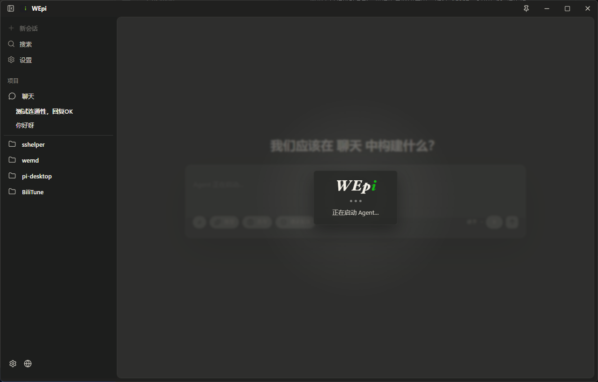

# WEPi

 <td align="center">
  <tr>
    <td align="center"></td>
    <td align="center"></td>
    <td align="center"></td>
  </tr>
</table>

---

## 架构设计

```txt
WEpi
├─ Electron 主进程
│  ├─ 管理项目记录
│  ├─ 启动 pi --mode rpc 进程
│  ├─ 管理 Agent 绑定的本地 pty 终端
│  ├─ 桥接文件、会话、Git 操作
│  ├─ 检查 GitHub Release 更新
│  └─ 暴露安全 IPC API
│
├─ Electron Preload
│  └─ 向 Renderer 暴露 window.piDesktop
│
├─ React Renderer
│  ├─ 项目和 Agent 列表
│  ├─ 聊天时间线（流式输出）
│  ├─ 文件 / 历史抽屉
│  ├─ 配置与 Skill 管理弹窗（配置管理 / Skills）
│  ├─ Agent 绑定的 Terminal Dock
│  ├─ 模型与上下文状态栏
│  ├─ 会话结束修改摘要与更新提示弹窗
│  └─ 设置 UI（基础设置 / 代理设置 / 开发设置）
│
└─ Pi 运行时
   ├─ 每个 Agent Tab 一个独立 pi RPC 进程
   ├─ 项目级 cwd 隔离
   └─ 使用 pi 原生会话 / 工具 / 模型 / 上下文
```

核心设计原则：**一个 Agent Tab = 一个 pi RPC 进程**，确保会话隔离，让 pi 继续负责其原生能力。

---

## 环境要求

- Node.js 20+
- npm
- 系统 `PATH` 中可访问 `pi` 命令
- 已完成 pi 的 Provider / 登录 / API Key 配置

验证 pi 是否可用（启动wepi后将自动检查，但不代替用户安装）：

```bash
pi --version
pi --mode rpc
```

---

## 下载安装

**Windows**平台的预构建安装包在 GitHub Release 中发布：

[GitHub Releases](https://github.com/wep56/wepi/releases)


---

## 快速开始（从源码运行）

```bash
git clone https://github.com/wep56/wepi.git
cd pi-desktop
npm install
npm run make-icon
npm run dev
```

---

## 开发命令

| 命令 | 说明 |
|---|---|
| `npm run dev` | 启动开发模式 |
| `npm run typecheck` | 运行 TypeScript 类型检查 |
| `npm run build` | 构建 Renderer + Main 产物 |
| `npm run dist` | 为当前平台打包 |
| `npm run dist:win` | 打包 Windows（NSIS + portable + zip） |
| `npm run dist:mac` | 打包 macOS（DMG + zip） |
| `npm run dist:linux` | 打包 Linux（AppImage + deb + tar.gz） |
| `npm run make-icon` | 生成图标资源到 `build/icon.svg` |

### 浏览器预览模式

直接打开 `http://localhost:5173/` 进行布局和响应式调试。Renderer 在 `window.piDesktop` 不可用时自动降级为 mock 数据，无需 Electron 环境。但涉及 Agent、会话、文件操作等真实 IPC 功能仍需在 Electron 中验证。

---

## 项目结构

```txt
src/
├─ main/
│  ├─ fs/                 # 文件树服务
│  ├─ git/                # Git 分支服务
│  ├─ pi/                 # Pi 进程与 RPC 管理
│  ├─ projects/           # 项目记录持久化
│  ├─ sessions/           # Pi 会话扫描
│  ├─ settings/           # 应用设置持久化
│  ├─ terminal/           # Agent 绑定的 pty 终端
│  └─ index.ts            # Electron 主入口
│
├─ preload/
│  └─ index.ts            # 安全 IPC 桥接
│
├─ renderer/
│  └─ src/
│     ├─ App.tsx          # 主界面
│     ├─ components/      # 拆分后的 UI 组件
│     ├─ config/          # 配置弹窗子组件和配置工具
│     ├─ previewApi.ts    # 浏览器预览降级
│     ├─ styles.css       # 应用样式
│     └─ main.tsx         # React 入口
│
└─ shared/
   ├─ ipc.ts              # IPC 通道名称
   └─ types.ts            # 共享类型定义
```

## 致谢
本项目的rpc连接、配置管理参考了：
- [acp-adapter](https://github.com/beyond5959/acp-adapter)
- [PiDeck](https://github.com/ayuayue/PiDeck)

界面设计、使用习惯参考了
- [codex-desktop](https://github.com/openai/codex)


## License

MIT
