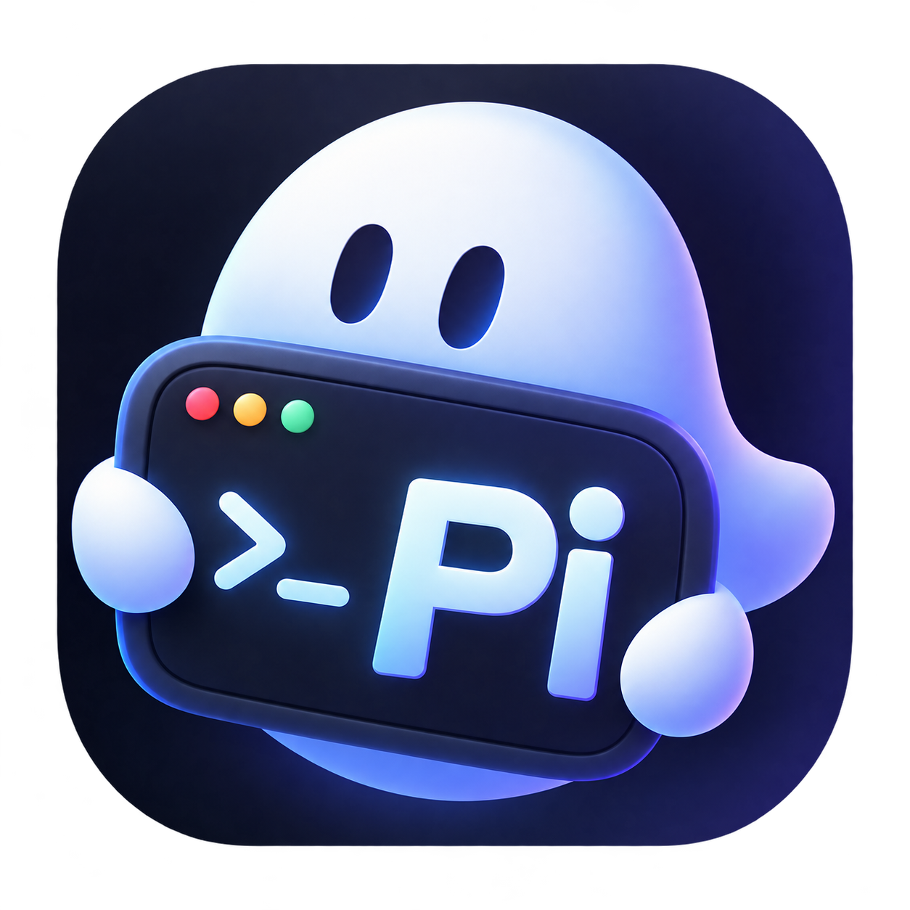
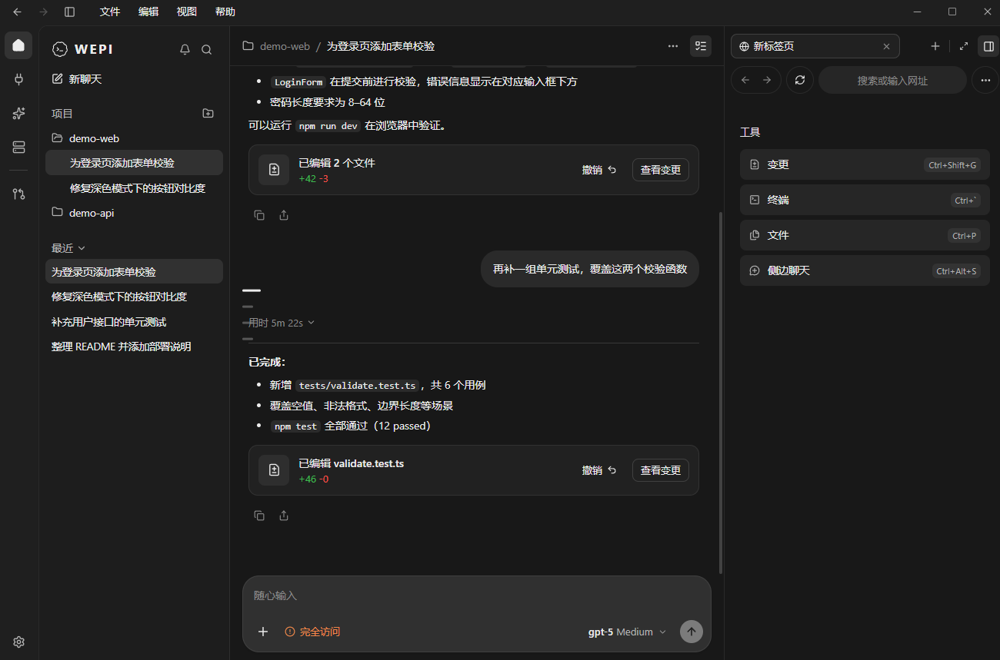
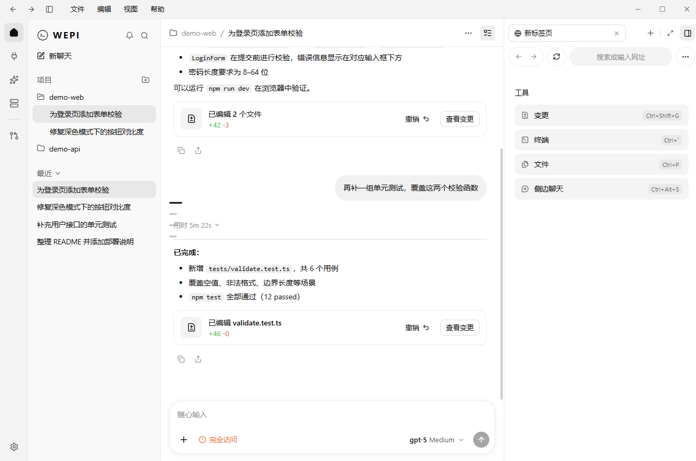

<div align="center">



# WEPI

**开源 AI Agent 桌面工作台**

基于 Tauri 2 的 Pi Coding Agent 桌面客户端：把本地项目、多会话任务、
MCP / Skill / 扩展管理装进一个原生的、轻量的工作台。

[](https://tauri.app)
[](https://react.dev)
[](https://www.rust-lang.org)
[](./LICENSE)

</div>

---

## ✨ 特性

- **💬 对话即工作流** — 思考、工具调用、过程叙述按 agent turn 时序折叠进时间线，
  只有最终回答渲染为正文；粘滞滚动跟随流式输出，回到底部一键直达
- **📁 多会话并行** — 每个会话独立 Pi 进程，切换不打断、后台继续跑；
  事件按会话路由互不串台
- **🛠 全面的 Pi 管理** — MCP 多来源分层配置（可从 Claude / Codex 导入）、
  Skill 发现与一键安装、扩展商店、Pi 版本管理 / 命令源诊断
- **🗂 工作区面板** — 文件浏览、变更审查（diff 视图）、集成终端、内置网页标签页
- **🖥 原生体验** — 系统托盘常驻、关闭行为可配置（退出 / 托盘运行）、
  自定义标题栏、深浅色主题

## 📷 预览

<div align="center">

<br/><br/>

</div>

## 🚀 快速开始

### 环境要求

- Windows 10/11
- [Node.js](https://nodejs.org) ≥ 18
- [Rust](https://www.rust-lang.org/tools/install)（MSVC 工具链）
- Visual Studio C++ Build Tools
- WebView2 Runtime（Windows 11 自带）
- 已安装的 [Pi Coding Agent](https://pi.dev)（`pi` 命令可在 PATH 中找到）

### 运行

```sh
git clone https://github.com/WEP-56/wepi.git
cd WEPI
npm install
npm run desktop:dev
```

首次运行会下载并编译 Rust 依赖，之后修改 React 代码即可热更新。

### 构建

```sh
npm run desktop:build
```

安装包输出到 `src-tauri/target/release/bundle/nsis/`。

## 🏗 架构

```
┌─────────────────────────────────────────────┐
│  React 19 + Vite（前端，单文件产物）           │
│  ├─ 聊天视图（blocks 时间线 / 粘滞滚动）        │
│  ├─ 工作区面板（文件 / diff / 终端 / 网页）     │
│  └─ 管理页（MCP / Skill / 扩展 / 版本）        │
├─────────────────────────────────────────────┤
│  Rust 后端（Tauri 2）                         │
│  ├─ Pi RPC 进程管理（握手式就绪 + 事件归一化）   │
│  ├─ 会话文件读写（JSONL）                      │
│  ├─ 工作区（git 快照 / PTY 终端 / 子 webview）  │
│  └─ 系统托盘 / 关闭行为                        │
├─────────────────────────────────────────────┤
│  Pi Coding Agent（--mode rpc，stdio JSONL）   │
└─────────────────────────────────────────────┘
```

- **Pi 归属边界**：Agent 行为（模型、思考档位、工具执行）由 Pi 自主持有，
  WEPI 只负责窗口、会话编排与配置界面，不引入第二条通信通道
- **就绪握手**：进程启动后先完成 `get_state` 请求/响应才放行 prompt，
  避免首条消息在 RPC 循环尚未消费 stdin 时被丢弃
- **事件归一化**：Rust 侧把 Pi 的原始事件映射为前端统一类型并按 16ms
  合并流式增量，前端用纯函数归约器推进每个回合的渲染状态

## 📜 开发说明

- 前端仅浏览器预览：`npm run dev`（Pi 相关功能需桌面运行时）
- 配置文件：`src-tauri/tauri.conf.json`（窗口 / 应用信息）
- 权限：`src-tauri/capabilities/default.json`
- 关闭行为与应用偏好：`~/.wepi/settings.json`

## 📄 许可

[MIT](LICENSE)

---

<div align="center">

**WEPI** · 让 Pi 在你的桌面上优雅地工作

</div>
